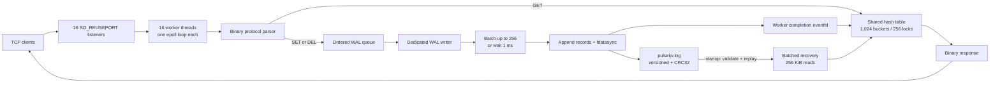
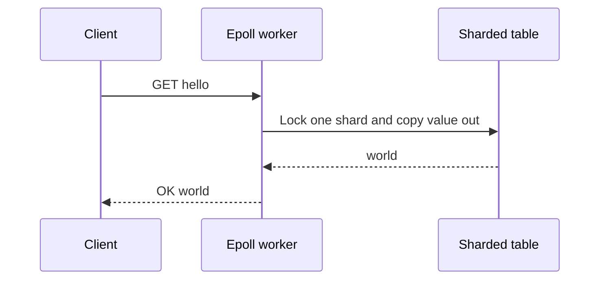
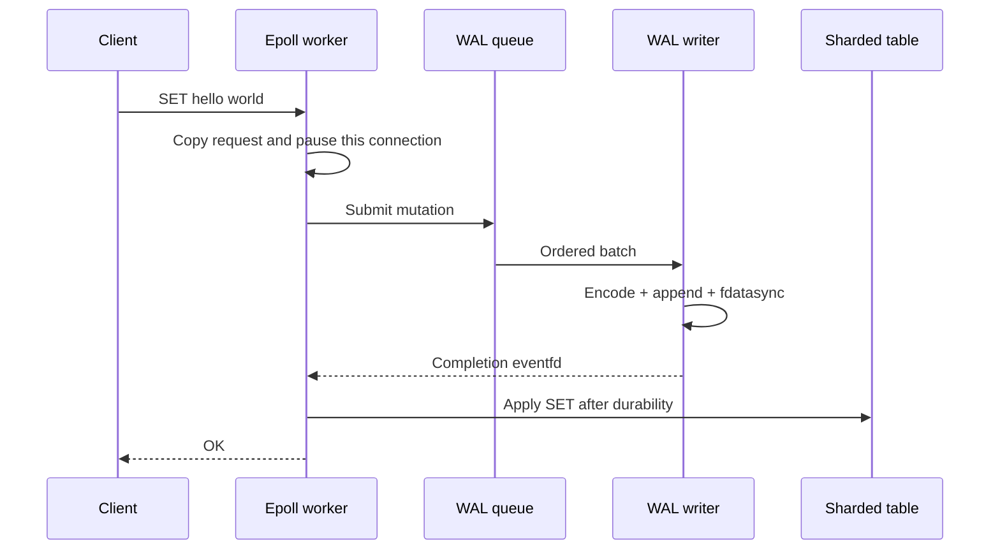

# PulseKV Architecture Guide

PulseKV is a small Redis-like key-value server built from operating-system primitives. The point
is not merely to support `SET`, `GET`, and `DEL`; it is to demonstrate how a network service becomes
concurrent, thread-safe, durable, recoverable, and measurable one layer at a time.

## The system in one picture



The networking workers never wait for disk. One WAL thread owns persistence and wakes the correct
worker after a mutation is durable. All workers share one logical table, but unrelated keys can use
different shard locks concurrently.

## What happens to one command

### GET: memory-only read



GET does not enter the WAL because it does not change state.

### SET or DEL: durable mutation



The order is deliberately **disk first, memory second, response last**. If the disk write fails,
the worker returns `ERROR` and does not change the table.

## What is stored in the WAL

```text
[magic "PKWL"] [version] [SET/DEL] [record length] [sequence]
[key length] [value length] [key bytes] [value bytes] [CRC32]
```

Your 79-byte demonstration file contained exactly:

| Sequence | Operation | Key | Value | Record size |
|---:|---|---|---|---:|
| 1 | SET | `hello` | `world` | 42 bytes |
| 2 | DEL | `hello` | — | 37 bytes |

`42 + 37 = 79`, matching `ls -lh`. The GETs are absent because they are reads. The CRC at the end of
each record detects corruption, while the total length detects a crash-truncated tail.

## Why each build step exists

| Step | Feature | Systems concept learned | State |
|---:|---|---|---|
| 1 | TCP server + binary protocol | Framing bytes over a stream | Complete |
| 2 | Edge-triggered epoll | Non-blocking multiplexed I/O | Complete |
| 3 | Hash table + one mutex | Correct shared mutable state | Complete |
| 4 | 16 thread-per-core workers | Multicore networking with `SO_REUSEPORT` | Complete |
| 5 | 1,024 buckets / 256 locks | Reduce unrelated-key lock contention | Complete |
| 6 | Async checksummed WAL | Durability, batching, ownership, completion signaling | Complete |
| 7 | WAL recovery | Rebuild memory and repair a damaged tail after restart | Complete |
| 8 | 500-client benchmark and tuning | Measure and optimize real throughput and tail latency | Complete |

These are not random features. Each step removes a specific limitation from the previous version:


## What each test proves

| Test | Claim it validates |
|---|---|
| `manual_cli.py` | A human can perform the expected SET/GET/DEL lifecycle |
| `test_hashtable` | Buckets, shard locks, collisions, ownership, and concurrent table access are correct |
| `test_wal` | Record format, CRC, truncation detection, ordering, batching, and disk errors are correct |
| `test_wal_server` | A mutation is durable before it changes memory and before the client receives `OK` |
| `test_recovery` | Restart replay, sequence continuity, crash-tail repair, and batched-read efficiency work |
| `test_multi_client` | Partial frames, stalled clients, pipelining, and large bursts do not block or reorder work |
| `test_thread_stress` | 64 clients can issue 80,780 operations without corrupting shared or unique keys |
| `benchmark` | 500 verified persistent clients report throughput and per-operation p50/p99/p999 |
| Valgrind | Allocated memory is freed and invalid memory access is absent |
| ThreadSanitizer | Cross-thread data races and lock-order problems are absent in the exercised paths |

Passing a test does not prove every possible bug is absent. Together, these tests connect each
architectural claim to observable evidence instead of relying on a successful manual demo alone.

## Where the project stands

The server now loads `pulsekv.log` before it accepts clients. It replays valid SET/DEL records into
the sharded table and continues sequence numbering from the recovered tail. If a crash left a short
record—or CRC or sequence validation fails—it preserves everything before that boundary, truncates
and syncs the damaged tail, and then starts normally. The final phase adds an epoll-based
500-connection benchmark and uses its results to tune batching, wakeup coalescing, completion
handoff, accepted sockets, and worker count without weakening durability.

## The short explanation for a demo or interview

> PulseKV is a Linux key-value server in C. Sixteen `SO_REUSEPORT` workers each own an
> edge-triggered epoll loop. They share a 1,024-bucket hash table protected by 256 striped locks.
> GET reads memory directly. SET and DEL go through a dedicated asynchronous WAL writer that
> batches up to 256 checksummed records and calls `fdatasync`; only then does the originating worker update
> memory and answer the client. Startup restores the table using 256 KiB batched WAL reads and
> repairs a damaged tail at the last valid record. An epoll load generator validates every response
> across 500 persistent clients and reports throughput plus p50/p99/p999. Valgrind and
> ThreadSanitizer cover memory and race safety.
