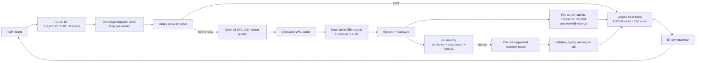
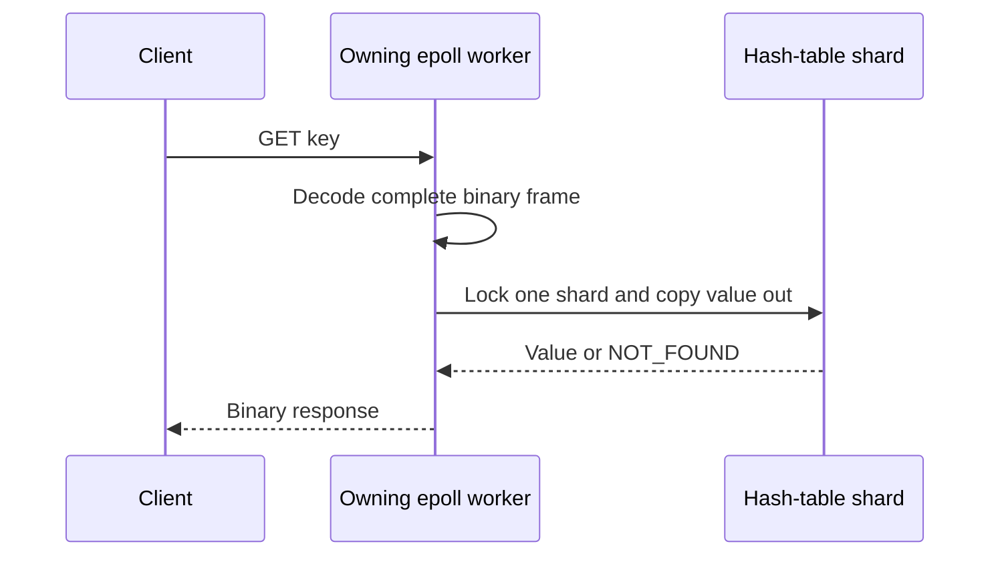
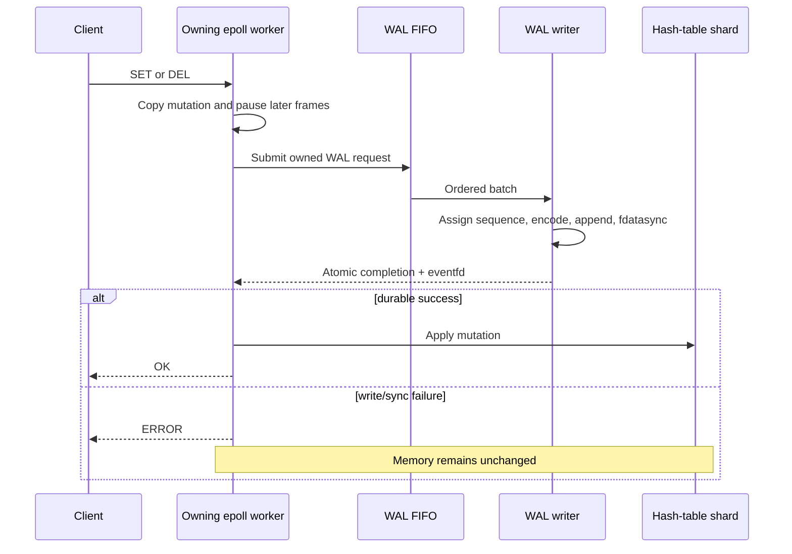

# PulseKV Project Progress Report

**Report date:** August 16, 2026  
**Repository:** `pulsekv`  
**Branch:** `master`  
**Source snapshot:** `0b467d9` — `Improve benchmark stall detection and runtime messaging`  
**Implementation status:** All eight documented build phases are complete

---

## 1. Executive Summary

PulseKV has evolved from an empty C project into a Linux-native, persistent, concurrent key-value
server built directly on operating-system primitives. It supports `GET`, `SET`, and `DEL` over a
binary TCP protocol and now includes:

- non-blocking edge-triggered `epoll` networking;
- up to 16 thread-per-core workers with one `SO_REUSEPORT` listener and one epoll instance per
  worker;
- a shared hash table with 1,024 physical buckets and 256 striped mutex shards;
- an asynchronous write-ahead log (WAL) with a dedicated writer, checksummed records, ordered
  sequence numbers, group commit, and sticky error handling;
- crash recovery using batched sequential reads, record validation, replay, and damaged-tail
  repair;
- a correctness-checking benchmark that drives 500 persistent clients and reports throughput and
  latency percentiles;
- memory, concurrency, failure-path, restart, and protocol test coverage using Valgrind,
  ThreadSanitizer, AddressSanitizer/UBSan, static analysis, and purpose-built integration tests.

The original throughput objective was **25,000+ requests per second with 500 clients**. A
representative two-vCPU Docker Desktop run sustained approximately:

| Workload | Verified requests | Throughput | Overall p99 | Throughput target |
|---|---:|---:|---:|---|
| 100% `GET` | 500,000 | 192,120 req/s | 5.574 ms | Met, about 7.7× target |
| 90% `GET`, 8% `SET`, 2% `DEL` | 500,000 | 177,557 req/s | 7.619 ms | Met, about 7.1× target |
| 100% durable `SET` | 500,000 | 113,406 req/s | 11.208 ms | Met, about 4.5× target |

Every response in those runs was checked for the expected status and value. The `<5 ms p99`
objective was achieved in some shorter read tests, but not in the representative sustained run.
It remains a scorecard rather than a correctness assertion because client and server shared two
virtual CPUs and durable workloads intentionally include real `fdatasync` latency.

This is no longer a collection of unrelated features. Each completed phase removes a concrete
limitation from the previous phase:


---

## 2. Original Goals and Current Status

### Functional goals

| Goal | Current status | Evidence |
|---|---|---|
| `GET`, `SET`, and `DEL` over TCP | Complete | Manual CLI, framing test, multi-client test |
| Shared in-memory key-value store | Complete | Hash-table unit and concurrency tests |
| Durable acknowledged mutations | Complete | WAL codec/writer tests and WAL server contract test |
| Survive restart and restore state | Complete | Recovery and separate-process restart tests |
| Detect crash-truncated or corrupted log tails | Complete | CRC, truncation, sequence, and physical repair tests |

### Non-functional goals

| Goal | Current status | Notes |
|---|---|---|
| 25K+ requests/sec | Demonstrated | 113K–192K req/s in representative sustained runs |
| 500 concurrent clients | Demonstrated | Benchmark opens and verifies 500 persistent sockets |
| `<5 ms` p99 latency | Partially demonstrated | Some read runs met it; sustained and durable profiles exceeded it |
| 1M+ resident keys | Not yet demonstrated | Store is correct, but fixed 1,024-bucket capacity has not been load-tested at this scale |
| 60%+ faster recovery than naive replay | Demonstrated in representative comparison | Approximately 4 ms batched vs. 20 ms naive; syscall reduction is the deterministic assertion |

The distinction above matters: throughput, concurrency, durability, and recovery behavior have
direct test evidence. The million-key and consistently sub-5-ms tail-latency goals remain future
capacity/performance work rather than claims the current evidence cannot support.

---

## 3. Current Architecture



### Component ownership

| Resource | Owner | Shared? | Synchronization |
|---|---|---:|---|
| Listening socket | One worker | No | Kernel distributes connections with `SO_REUSEPORT` |
| Epoll instance | One worker | No | No cross-thread epoll operations |
| Client connection and buffers | One worker | No | Worker event loop owns all socket state |
| Hash table | Process | Yes | 256 shard mutexes; one lock per operation |
| WAL submission queue | WAL service | Yes | Mutex/condition-variable FIFO |
| WAL file descriptor | WAL writer | No | Only the dedicated writer appends or syncs |
| WAL completion stack | One writer/worker pair | Pairwise | Lock-free atomic single-producer/single-consumer handoff |
| Shutdown notification | Process/workers | Yes | Atomic stop flag plus registered `eventfd` wakeup |

### Read path



`GET` is memory-only. It never enters the WAL because it does not mutate state. If it follows a
pending mutation on the same pipelined connection, it remains buffered until that mutation
completes, preserving client-visible ordering.

### Durable mutation path



The essential guarantee is **disk first, memory second, response last**. PulseKV never sends `OK`
for a mutation before its WAL batch has completed `fdatasync`.

---

## 4. Completed Work by Phase

### Foundation — scaffold and design

The project began with a written system design and a minimal repository structure. The design set
the target workload, Linux/POSIX constraints, build order, failure modes, and the intentional
progression from a simple correctness baseline to a measured concurrent service.

Key result:

- Architecture was planned before implementation, making later changes—thread-per-core workers,
  sharded locking, WAL ordering, and recovery—fit one coherent model.

### Step 1 — blocking TCP skeleton and binary protocol

Implemented a functioning TCP server and a compact binary wire format:

```text
Request:  [1-byte opcode][4-byte key length][key][4-byte value length][value]
Response: [1-byte status][4-byte value length][value]
```

Accomplishments:

- Defined `GET`, `SET`, and `DEL` opcodes and `OK`, `NOT_FOUND`, and `ERROR` statuses.
- Used network byte order for integer lengths.
- Established strict maximums: 1 KiB keys and 64 KiB values.
- Implemented encode/decode helpers for clients, server, and tests.
- Distinguished complete, incomplete, and malformed frames.
- Made decoded requests point into the caller's buffer instead of allocating during parsing.
- Added a framing round-trip client test.

Systems concepts demonstrated:

- TCP is a byte stream, not a message queue.
- Application framing must survive partial reads and combined frames.
- Input bounds must be validated before trusting offsets or allocating memory.

### Step 2 — single-threaded non-blocking epoll

Replaced the blocking request loop with an event-driven server.

Accomplishments:

- Added non-blocking sockets and one epoll event loop.
- Kept the level-triggered variant buildable for comparison.
- Progressed the default implementation to edge-triggered mode.
- Drained `accept`, `read`, and `write` operations until `EAGAIN`, as edge-triggering requires.
- Added per-connection read/write state and partial-frame reassembly.
- Enabled pipelining and queued responses in order.
- Registered `EPOLLOUT` only while a connection owed bytes, preventing writable-socket spin.
- Added backpressure when response space is temporarily unavailable.
- Tested stalled clients and bursts larger than the server read buffer.

Systems concepts demonstrated:

- Non-blocking multiplexed I/O.
- Edge-triggered drain discipline.
- Stateful parsing and output queues across multiple kernel events.
- Fairness: one incomplete client cannot block unrelated clients.

### Step 3 — in-memory hash table with a global mutex

Added real shared state behind the network protocol.

Accomplishments:

- Implemented FNV-1a hashing over binary key bytes.
- Used separate chaining for collisions.
- Added overwrite and delete semantics.
- Made the table own copies of keys and values.
- Made `GET` copy values out instead of returning unsafe internal pointers.
- Added an entry count and deterministic teardown.
- Protected the first concurrent version with one table-wide mutex.
- Added direct unit tests for empty tables, collisions, binary keys, overwrites, deletions,
  zero-length values, ownership, and undersized output buffers.

The global lock was deliberate. It established a simple correctness baseline whose contention
could later be measured and removed without changing store semantics.

### Step 4 — 16 thread-per-core epoll workers

Scaled networking across CPU cores without sharing an epoll descriptor.

Accomplishments:

- Refactored the event loop into a worker-thread function.
- Added up to 16 workers, with 16 as the default and maximum.
- Gave every worker its own listener, epoll instance, and live-connection list.
- Enabled `SO_REUSEADDR` and `SO_REUSEPORT` so all listeners bind port `9999`.
- Let the kernel distribute new connection flows across worker accept queues.
- Preserved edge-triggered behavior in each worker.
- Added startup coordination and `pthread_join` shutdown.
- Implemented a real wakeup mechanism for `SIGINT`/`SIGTERM` using `eventfd`, ensuring every worker
  parked in `epoll_wait` actually wakes and exits.
- Closed each worker's listener and client sockets during shutdown and destroyed the shared table
  exactly once after all workers joined.
- Added `-pthread` to compilation and linking.
- Added a 64-client, 300-iteration concurrent network stress test.

Stress-test evidence:

- 64 simultaneous connections.
- 80,780 total verified requests.
- Unique-key state remained intact.
- Shared hot keys always held a complete value from one writer—never torn or corrupted bytes.
- Churn keys finished in the expected deleted state.

### Step 5 — 1,024 buckets grouped under 256 mutex shards

Removed the single global table lock while retaining greater bucket capacity.

The design decision was to keep **1,024 physical bucket chains** and group them beneath **256 lock
shards**, rather than reducing the table to 256 total chains. Each shard therefore owns four
buckets.

Routing is deterministic and inexpensive:

```text
global_bucket  = hash & 1023
shard          = global_bucket & 255
bucket_in_shard = global_bucket / 256
```

Accomplishments:

- Separated hash distribution capacity from lock granularity.
- Allowed operations in different shards to proceed concurrently.
- Kept each operation to exactly one mutex acquisition.
- Added compile-time assertions that bucket and shard counts are valid powers of two and divide
  evenly.
- Added a relaxed atomic global entry counter for exact statistics without locking all shards.
- Extended tests to cover two-level routing, same-shard/different-chain keys, collision chains, and
  32-thread direct table stress.
- Updated the system design and architecture documentation to record the decision.

Why this is technically stronger than simply choosing 256 buckets:

- Four times as many chains reduce average chain length for the same number of resident keys.
- Mutex count and bucket capacity can be tuned independently.
- It demonstrates lock striping rather than equating one lock with one hash bucket.
- It preserves a simpler reclamation model than a lock-free table while removing most unrelated-key
  contention.

### Step 6 — asynchronous checksummed write-ahead log

Added durable persistence without blocking epoll workers on filesystem latency.

WAL version-one record format:

```text
[4-byte "PKWL"][2-byte version][1-byte opcode][1-byte flags]
[4-byte record length][8-byte sequence][4-byte key length][4-byte value length]
[key][value][4-byte IEEE CRC32]
```

Accomplishments:

- Added an append-only WAL for `SET` and `DEL`; reads are intentionally absent.
- Added a dedicated writer thread as the only owner of append and `fdatasync` operations.
- Added a synchronized FIFO for mutation submissions from all workers.
- Assigned contiguous 64-bit sequence numbers in writer order.
- Added version, magic, flags, opcode, length, bounds, sequence, and CRC32 validation.
- Added asynchronous completion delivery back to the originating worker.
- Ensured workers apply mutations only after durable completion.
- Preserved per-connection ordering by pausing later frames behind one outstanding mutation.
- Made the first disk error sticky so later operations cannot bypass a failed append.
- Correctly handled disconnect-after-submit: a durable mutation is still applied, but there is no
  socket response.
- Added a two-phase shutdown drain so worker-owned completion targets outlive pending WAL work.
- Added tests for every truncated prefix, payload corruption, binary keys/values, concurrent
  producers, group-commit accounting, ordering, and `/dev/full` failure containment.

The manual 79-byte WAL demonstration was decoded as:

| Sequence | Operation | Key | Value | Size |
|---:|---|---|---|---:|
| 1 | `SET` | `hello` | `world` | 42 bytes |
| 2 | `DEL` | `hello` | — | 37 bytes |

The total, `42 + 37 = 79`, matched the file size. `GET` was absent because it does not modify
state.

### Step 7 — crash recovery and physical tail repair

Made the WAL useful across real process lifetimes.

Accomplishments:

- Recovered the table before opening listeners or accepting clients.
- Read the WAL sequentially in 256 KiB chunks.
- Preserved partial records across read-buffer boundaries.
- Revalidated every replayed record instead of trusting disk contents.
- Replayed `SET` and `DEL` in contiguous sequence order.
- Continued new WAL numbering at `last_sequence + 1`.
- Treated the first incomplete, corrupted, or out-of-sequence record as the crash boundary.
- Truncated the physical file to the last valid byte and synced the repair before accepting new
  writes.
- Reported recovered records, valid/original bytes, read calls, restored keys, repaired bytes, and
  elapsed time.
- Compared batched recovery with a deliberately naive record-at-a-time reader.

Recovery evidence for a 20,000-record fixture:

- Batched implementation: 6 read calls.
- Naive implementation: 40,001 read calls.
- Representative time: approximately 4 ms batched versus 20 ms naive.
- The deterministic syscall reduction is asserted; wall-clock time is reported but not used as a
  flaky pass/fail threshold.

### Step 8 — 500-client benchmarking and broad hot-path optimization

Added a reproducible performance harness and used it to change the server based on measurements.

#### Benchmark implementation

`tests/benchmark.c` is itself an event-driven client:

- one client-side epoll loop manages 500 persistent sockets;
- one request is kept in flight per connection;
- each connection owns its key and expected state;
- seeding and warmup complete before the measured interval;
- every response status and value is verified;
- workloads are configurable as read, mixed, or durable write;
- request count, client count, and warmup count are configurable;
- latency samples report minimum, mean, p50, p99, p999, and maximum overall and per opcode;
- a 30-second no-progress timeout turns a stalled run into an explicit failure;
- protocol failures and incomplete runs fail; performance targets are printed as honest scorecards.

Using one epoll load generator instead of 500 client pthreads materially reduced scheduler noise on
the two-vCPU Docker environment.

#### Server optimizations retained after measurement

1. **Configurable worker count**
   - `PULSEKV_THREADS=1..16` allows thread-per-core deployment on constrained machines.
   - The benchmark wrapper reserves one visible CPU for its co-located load generator by default.

2. **Larger measured WAL batches**
   - Default batch maximum changed from 64 to 256 records.
   - The one-millisecond maximum batching delay was retained.
   - Local tests found the 256-record choice roughly doubled fully durable throughput relative to
     the earlier 64-record configuration while avoiding the diminishing returns of still larger
     batches.

3. **Dynamic WAL encode memory**
   - The writer grows its encode buffer to the actual batch size.
   - It no longer reserves `batch_max × maximum_record_size` for ordinary small mutations.

4. **Coalesced producer and completion wakeups**
   - Queue condition-variable signals occur when useful rather than once per submitted record.
   - Worker `eventfd` notifications are coalesced so a batch does not create unnecessary wakeups.

5. **Lock-free writer-to-worker completion handoff**
   - The writer is the sole producer and each worker is the sole consumer of its completion stack.
   - Atomic release/acquire operations replace a per-worker completion mutex queue.
   - Workers reverse detached batches back into FIFO completion order.
   - ThreadSanitizer validation found no race in the exercised paths.

6. **Network hot-path improvements**
   - `accept4` creates accepted sockets non-blocking and close-on-exec in one operation.
   - Accepted sockets enable `TCP_NODELAY`.
   - Read-buffer consumption avoids zero-length `memmove` calls.

#### Baseline and optimized observations

An early, scheduler-heavy 500-thread client baseline on two CPUs observed:

| Workload | Early observed throughput | Early p99 |
|---|---:|---:|
| Read | 155,874 req/s | 16.544 ms |
| Mixed | 118,186 req/s | 34.767 ms |
| Durable write | 53,393 req/s | 20.680 ms |

The final epoll-driven sustained run observed:

| Workload | Final throughput | Final p50 | Final p99 | Final p999 |
|---|---:|---:|---:|---:|
| Read | 192,120 req/s | 2.408 ms | 5.574 ms | 22.998 ms |
| Mixed | 177,557 req/s | 2.389 ms | 7.619 ms | 20.969 ms |
| Durable write | 113,406 req/s | 4.046 ms | 11.208 ms | 41.874 ms |

These tables show end-to-end evolution, not an isolated microbenchmark of one server change: the
load generator and worker allocation were also improved. The durable-write result is nevertheless
consistent with the controlled WAL batch experiments showing approximately a twofold improvement
from the original 64-record batch.

The final long run processed:

- 1,500,000 measured requests across the three profiles;
- 1,576,500 total server requests including setup/warmup work;
- 579,000 WAL records;
- 3,383 WAL batches and `fdatasync` operations;
- batches as large as the configured 256-record maximum.

---

## 5. Protocol, Storage, and Durability Details

### Protocol safety properties

- Length fields are validated against fixed maximums before payload access.
- Binary keys are supported; embedded NUL bytes do not terminate comparisons.
- An incomplete frame remains buffered without affecting other clients.
- A malformed frame returns an error and closes the unsafe connection.
- The parser exposes views rather than allocating temporary request objects.

### Hash-table safety properties

- Set operations copy caller-owned key and value bytes.
- Get operations copy data into caller-owned storage before releasing the shard lock.
- Delete never leaves a returned pointer that another thread can use after free.
- Collision chains preserve keys that hash to the same physical bucket.
- An overwrite changes the value without incrementing the entry count.
- Teardown visits every shard and every chain exactly once.

### WAL durability semantics

- An `OK` mutation response means its record was included in a successful `fdatasync`.
- A WAL error means the table mutation was not applied.
- Earlier durable batches remain readable after a later sticky failure.
- A process crash after sync but before sending the response creates an **unknown commit result**
  for that client: the record may be recovered even though the client did not receive `OK`.
- Client retry logic should therefore use idempotent operations or future request identifiers.
- The WAL is append-only and currently has no snapshot or compaction mechanism.

### Shutdown semantics

1. `SIGINT` or `SIGTERM` sets the atomic stop state and writes the registered wakeup `eventfd`.
2. Every worker wakes from `epoll_wait` rather than relying on signal timing.
3. Workers close listeners and client sockets.
4. Connection shells referenced by submitted WAL requests remain alive.
5. Durable completions are drained and applied.
6. Main joins all workers.
7. The WAL writer drains, stops, and joins.
8. The shared table is destroyed exactly once.

This ordering prevents use-after-free between the writer, workers, connections, and shared table.

---

## 6. Verification and Test Evidence

### Purpose-built tests

| Test | What it verifies | Recorded result |
|---|---|---|
| `test_client` | Basic binary request/response framing | Passed |
| `test_hashtable` | Routing, ownership, collision, overwrite, delete, errors, direct concurrency | PASS, 49 checks |
| `test_multi_client` | Partial frames, pipelining, cross-client visibility, burst draining | PASS, 124 requests |
| `test_thread_stress` | 64 concurrent clients and shared/unique-key integrity | PASS, 80,780 requests |
| `test_wal` | Codec, CRC32, truncation, ordering, group commit, `/dev/full` | PASS, 31 checks |
| `test_wal_server` | WAL-before-memory/response contract | PASS, 7 checks |
| `test_recovery` | Replay, sequence handoff, corrupt-tail repair, batched efficiency | PASS, 28 checks |
| `benchmark` | 500 persistent clients with verified values/statuses and latency statistics | PASS in read, mixed, and write profiles |
| `manual_cli.py` | Human-readable `SET`/`GET`/`DEL` demonstration | Passed |

### Specific integration scenarios exercised

- Five active clients continue while a sixth sends only three bytes of a frame and stalls.
- A full `SET → GET → DEL → GET` lifecycle arrives in one pipelined write and completes in order.
- An 81,440-byte burst containing 80 frames exceeds the server read buffer and is fully drained.
- Sixty-four real client threads concurrently hammer connection-unique and shared keys.
- A client disconnects after WAL submission without invalidating durable ownership.
- A WAL append to `/dev/full` fails, returns `ERROR`, leaves memory unchanged, and terminates the
  service through its sticky failure policy.
- Data is seeded in one process, the server stops, and a separate process verifies recovered state.
- Truncated, CRC-invalid, and sequence-invalid WAL tails are physically removed before new appends.
- Edge-triggered and level-triggered server builds both pass multi-client behavior.

### Valgrind results

The leak-check runs used `--leak-check=full --error-exitcode=1`. Recorded summaries included:

| Target | Allocations/frees | Bytes in use at exit | Errors |
|---|---:|---:|---:|
| WAL unit test | 274 / 274 | 0 | 0 |
| Recovery test | 42,091 / 42,091 | 0 | 0 |
| Benchmark client | 5 / 5 | 0 | 0 |
| Server integration run | 2,498 / 2,498 | 0 | 0 |

All reported only the three standard file descriptors at process exit where applicable.

### Race, undefined-behavior, and static analysis

- A separate `-fsanitize=thread` build was produced for the server and tests.
- Hash-table, WAL, recovery, multi-client, stress, WAL-server, and benchmark paths ran without
  ThreadSanitizer race reports.
- AddressSanitizer and UndefinedBehaviorSanitizer server/benchmark smoke runs produced no sanitizer
  failures.
- GCC `-fanalyzer` with warnings treated as errors completed cleanly for the server and benchmark.
- Both edge-triggered and level-triggered variants were compiled and exercised.

### Latest smoke verification

After the final stall-detection and runtime-message changes, a fresh Linux Docker build compiled
every normal target without compiler warnings. A shortened 500-client smoke benchmark then passed
25,000 verified requests per profile:

| Workload | Smoke throughput | Smoke p99 | Correctness |
|---|---:|---:|---|
| Read | 186,876 req/s | 5.494 ms | PASS |
| Mixed | 151,477 req/s | 12.994 ms | PASS |
| Durable write | 135,860 req/s | 7.037 ms | PASS |

The server processed 84,000 total requests and 31,750 WAL records in 194 synced batches during
that smoke run.

---

## 7. Build, Run, Demo, and Benchmark Reference

PulseKV requires Linux APIs (`epoll`, `eventfd`, and `SO_REUSEPORT`). On macOS, run the build and
server inside Docker.

### Build the Linux development image

```sh
cd ~/Desktop/Projects/pulsekv
docker build -t pulsekv-dev .
```

The image contains Debian Bookworm, GCC, Make, libc development headers, Valgrind, and process
inspection tools.

### Compile everything

```sh
docker run --rm \
  -v "$PWD:/src" \
  -w /src \
  pulsekv-dev \
  make clean all
```

Build products are written into the host-mounted `build/` directory.

### Start an interactive server container

First make sure port `9999` is not already published:

```sh
docker ps --format 'table {{.Names}}\t{{.Ports}}'
lsof -nP -iTCP:9999 -sTCP:LISTEN
```

Then start the container:

```sh
docker run --rm --name pulsekv-demo \
  -p 9999:9999 \
  -v "$PWD:/src" \
  -w /src \
  -it pulsekv-dev bash
```

Inside that container:

```sh
make clean all
PULSEKV_WAL_PATH=/src/pulsekv.log ./build/pulsekv
```

Leave that terminal running. From a second macOS terminal:

```sh
cd ~/Desktop/Projects/pulsekv
python3 tests/manual_cli.py
```

Example interaction:

```text
pulsekv> SET hello world
OK
pulsekv> GET hello
OK -> world
pulsekv> DEL hello
OK
pulsekv> GET hello
NOT_FOUND
```

Press `Ctrl-C` in the server terminal to exercise graceful shutdown and print recovery, request,
connection, per-thread, and WAL batch statistics.

### Inspect durable records

```sh
ls -lh pulsekv.log
xxd -l 128 pulsekv.log
strings pulsekv.log
```

`xxd` shows the binary record fields. `strings` may reveal printable key/value payloads, but it is
not a complete decoder and should not be used as integrity proof. `test_wal` and recovery parsing
provide the actual structural and CRC validation.

### Run standalone unit tests inside the container

```sh
./build/test_hashtable
./build/test_wal
./build/test_recovery
```

### Run network tests while the server is running

```sh
./build/test_client
./build/test_multi_client
./build/test_thread_stress
PULSEKV_WAL_PATH=/src/pulsekv.log ./build/test_wal_server
```

Use an isolated WAL for automated tests so previous manual data cannot affect expected state.

### Run all benchmark profiles reproducibly

The wrapper creates and removes its own temporary WAL, starts the server, waits until it is ready,
runs all three profiles, shuts the server down, and prints the server summary:

```sh
docker run --rm \
  -v "$PWD:/src" \
  -w /src \
  pulsekv-dev \
  make bench
```

Useful overrides:

```sh
PULSEKV_BENCH_WORKERS=4 PULSEKV_BENCH_REQUESTS=200 make bench
PULSEKV_BENCH_WARMUP=10 make bench
make bench-lt
```

Run one profile directly against an already-running server:

```sh
./build/benchmark --clients 500 --requests 1000 --warmup 50 --workload read
./build/benchmark --clients 500 --requests 1000 --warmup 50 --workload mixed
./build/benchmark --clients 500 --requests 1000 --warmup 50 --workload write
```

### Build ThreadSanitizer binaries

```sh
make tsan
```

Instrumented binaries are placed under `build/tsan/`.

### Run representative Valgrind checks

```sh
valgrind --leak-check=full --error-exitcode=1 ./build/test_hashtable
valgrind --leak-check=full --error-exitcode=1 ./build/test_wal
valgrind --leak-check=full --error-exitcode=1 ./build/test_recovery
```

---

## 8. Configuration Reference

| Setting | Default | Control |
|---|---:|---|
| TCP port | `9999` | `PULSEKV_PORT` compile-time constant |
| Worker count | `16` | `PULSEKV_THREADS=1..16` |
| Listen backlog | `512` | `LISTEN_BACKLOG` compile-time constant |
| Trigger mode | Edge-triggered | Build `pulsekv_lt` for level-triggered mode |
| Physical hash buckets | `1,024` | `PK_TABLE_BUCKETS` |
| Lock shards | `256` | `PK_TABLE_SHARDS` |
| Maximum key | `1 KiB` | `PK_MAX_KEY_LEN` |
| Maximum value | `64 KiB` | `PK_MAX_VAL_LEN` |
| WAL file | `pulsekv.log` | `PULSEKV_WAL_PATH` |
| WAL batch maximum | `256` records | `PULSEKV_WAL_BATCH_MAX` |
| WAL batch deadline | `1,000 µs` | `PULSEKV_WAL_DELAY_US` |
| Recovery read chunk | `256 KiB` | `PULSEKV_RECOVERY_CHUNK` |
| Per-request server logging | Enabled | `PULSEKV_QUIET=1` disables it |
| Recovery bypass | Disabled | `PULSEKV_SKIP_RECOVERY`; fault injection only |

---

## 9. Repository and Documentation State

### Main source files

| File | Responsibility |
|---|---|
| `src/main.c` | Listeners, epoll workers, connection state, dispatch, WAL integration, shutdown |
| `src/protocol.c` | Binary request and response encoding/decoding |
| `src/hashtable.c` | FNV-1a routing, bucket chains, shard locking, key/value operations |
| `src/wal.c` | Record codec, CRC32, async writer, batching, completions, recovery |
| `tests/benchmark.c` | Correctness-checking epoll load generator |
| `tests/run_benchmarks.sh` | Isolated benchmark orchestration |

The tracked implementation, tests, headers, and Markdown documentation total approximately **6,840
lines**, excluding the README, Makefile, Dockerfile, and generated build artifacts.

### Documentation produced

- `README.md` — project overview, build instructions, component design, testing, configuration, and
  roadmap.
- `docs/system-design.md` — requirements, high-level design, deep technical decisions, failure
  modes, trade-offs, and build order.
- `docs/architecture-guide.md` — visual request flows, WAL explanation, build-step rationale, test
  mapping, and interview summary.
- `docs/project-progress-report.md` — this consolidated implementation and evidence report.

### Commit history through this report's source snapshot

| Commit | Milestone |
|---|---|
| `2c81a3d` | Initial scaffold and system design |
| `09a918b` | Step 1 TCP skeleton and protocol |
| `e8c3ac5` | Step 2 single-threaded epoll, LT to ET |
| `4a5a13f` | Linux Docker/Valgrind development environment |
| `4b16e3f` | Step 3 in-memory table and global mutex |
| `f9cfa6e` | Manual CLI test tool |
| `03800ed` | Step 4 thread-per-core epoll workers |
| `88240f6` | Comprehensive Steps 1–4 README |
| `2a7c36b` | Step 5 striped hash-table locks |
| `8925e2b` | Steps 6–7 and most Step 8 implementation/documentation |
| `0b467d9` | Benchmark stall protection and final runtime/documentation corrections |

At report generation time, `master`, `origin/master`, and `origin/HEAD` all pointed to `0b467d9`.
The source tree was clean before this new report file was added.

---

## 10. Important Engineering Decisions

| Area | Decision | Why it was chosen |
|---|---|---|
| Networking | One listener and epoll instance per worker | Avoids a shared epoll bottleneck and thundering-herd behavior |
| Connection distribution | `SO_REUSEPORT` | Kernel distributes flows without a user-space accept dispatcher |
| Table concurrency | 256 mutex shards over 1,024 buckets | Reduces unrelated-key contention while retaining hash capacity |
| Memory safety | Copy-in/copy-out table ownership | Prevents callers from observing freed internal pointers |
| Mutation durability | WAL before memory and response | Never acknowledges a mutation that has not been synced |
| WAL execution | Dedicated writer thread | Keeps blocking filesystem operations outside epoll workers |
| WAL throughput | Ordered group commit | Amortizes `fdatasync` while retaining a single deterministic order |
| Completion routing | Per-worker atomic handoff plus `eventfd` | Writer never touches sockets or epoll-owned connection state |
| Recovery | Validate and physically truncate at first bad record | Preserves the valid prefix and prevents repeated discovery of damage |
| Benchmark client | One epoll loop over 500 sockets | Avoids 500 co-located client threads distorting latency measurements |
| Performance gates | Correctness hard-fails; latency targets are scorecards | Avoids hiding errors while preventing hardware-sensitive flaky tests |

---

## 11. Current Limitations and Honest Boundaries

PulseKV is a substantial systems project, but it is not yet a production Redis replacement.

1. **Single node and single process**
   - No replication, consensus, automatic failover, or distributed partitioning.

2. **Fixed hash-table capacity**
   - The table has 1,024 chains and no growth/rehash mechanism.
   - Correctness remains intact as chains grow, but lookup cost trends toward linear within long
     chains.
   - The 1M-key target needs resizing, capacity testing, and memory profiling.

3. **Unbounded append-only WAL**
   - There is no snapshot, checkpoint, rotation, or compaction.
   - Recovery time and disk consumption grow with the full mutation history.

4. **No authentication, authorization, or encryption**
   - The server should currently be treated as a local/private-network learning system.

5. **No formal client retry identity**
   - A disconnect after sync but before response has an unknown outcome.
   - The protocol lacks request IDs or conditional/idempotency tokens.

6. **Tail latency remains environment-sensitive**
   - `fdatasync`, Docker virtualization, CPU oversubscription, and co-located load generation all
     affect p99/p999.
   - Dedicated hardware should be used before claiming a production latency service level.

7. **One ordered WAL writer**
   - This preserves deterministic durability order and is appropriate for the current target.
   - At much higher write rates, the storage device and single ordered log can become the limiting
     path.

8. **Linux-specific implementation**
   - The server intentionally depends on `epoll`, `eventfd`, and `SO_REUSEPORT` behavior.
   - macOS development therefore requires the provided Linux container.

---

## 12. Recommended Next Phase

The documented eight-step build order is complete; there is currently no authoritative Step 9 in
the design. The strongest next phase would be **capacity and operational maturity**, in this order:

1. **Resizable or incrementally rehashed storage**
   - Remove the fixed 1,024-bucket scaling boundary.
   - Add a one-million-key capacity test and memory-per-key reporting.

2. **Snapshot/checkpoint and WAL compaction**
   - Write a consistent table snapshot.
   - Rotate the WAL after the snapshot is durable.
   - Recover from snapshot plus the smaller post-snapshot log.

3. **Dedicated performance environment and profiling**
   - Separate load-generator and server CPUs or hosts.
   - Record CPU profiles, context switches, syscalls, storage latency, and per-shard contention.
   - Revisit the `<5 ms` p99 goal with controlled hardware and explicit durability settings.

4. **Long-duration soak and fault testing**
   - Multi-hour mixed workload.
   - Repeated `SIGKILL` during WAL writes and automatic restart verification.
   - Disk-full, short-write, file-corruption, file-permission, and descriptor-exhaustion cases.

5. **Operational interface**
   - Health/readiness endpoint or administrative protocol command.
   - Machine-readable metrics for requests, latency, keys, WAL batches, recovery, and errors.
   - Configurable bind address and port.

6. **Protocol-level request identity**
   - Allow clients to retry mutations safely after an unknown commit result.

This sequence builds naturally on what already exists: first demonstrate the outstanding capacity
goal, then bound log growth and restart time, and finally make performance and operations suitable
for repeatable deployment.

---

## 13. Concise Demo or Interview Explanation

> PulseKV is a Linux key-value server written in C. Up to sixteen `SO_REUSEPORT` workers each own
> an edge-triggered epoll loop, so networking state is not shared between threads. The workers share
> one logical hash table with 1,024 buckets striped across 256 mutexes. `GET` reads memory directly;
> `SET` and `DEL` enter a dedicated asynchronous WAL writer, which batches up to 256 versioned,
> sequenced, CRC32-protected records and calls `fdatasync`. Only after that durable completion does
> the owning worker update memory and answer `OK`. Startup validates and replays the WAL using 256
> KiB reads and truncates any damaged tail at the last valid record. A client-side epoll benchmark
> validates every response across 500 connections and has measured roughly 113K–192K requests per
> second in a constrained two-vCPU Docker environment. Valgrind, ThreadSanitizer, recovery,
> concurrency, disk-failure, and restart tests cover the major safety claims.

---

## 14. Final Assessment

The project has accomplished its main educational and engineering objective: it demonstrates the
complete evolution of a network service from byte framing to event-driven concurrency, multicore
ownership, lock sharding, durable asynchronous writes, crash recovery, and measured optimization.

Its strongest qualities are:

- architecture and ownership are explicit;
- durability ordering is correct and tested;
- concurrency was introduced incrementally with a baseline at each stage;
- failures such as partial TCP frames, disk-full writes, corrupted WAL tails, disconnects, and
  shutdown races were designed for rather than ignored;
- performance results verify correctness instead of counting blind request completions;
- benchmark claims distinguish observed evidence from unmet or environment-sensitive goals.

The next meaningful work is not another random feature. It is to remove the known capacity and
operational limits—dynamic table growth, snapshots/WAL compaction, controlled latency profiling,
and long-duration fault testing—while preserving the durability and concurrency guarantees already
established.
