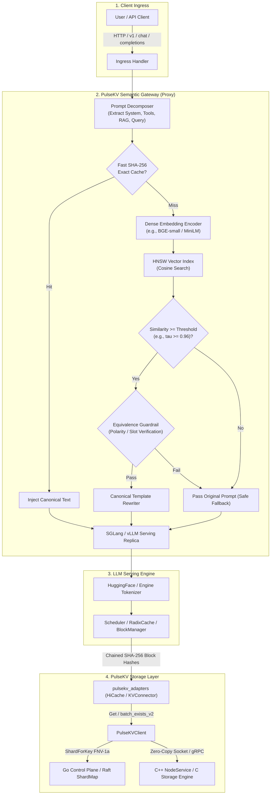

# PulseKV v2 — Semantic Prompt Canonicalization & Normalization Investigation Report

**Document Date:** August 18, 2026  
**Status:** Architectural Investigation & Technical Feasibility Report  
**Target Repository:** `pulsekv`  
**Scope:** Feasibility analysis of adding a semantic prompt canonicalization/normalization layer situated above the exact PulseKV distributed KV-cache layer.

---

## 1. Executive Summary

PulseKV v2 is currently a distributed, consensus-backed, tiered KV-cache storage engine optimized for LLM inference serving. Its cache reuse model is based on **exact token and block sequence identity**:
- SGLang uses deterministic chained SHA-256 block hashes over 4-byte big-endian token IDs.
- vLLM uses model-, layer-, and block-aware hierarchical keys (`vllm:{model}:layer_{id}:{block_hash}`).
- PulseKV stores and retrieves exact KV attention tensors across RAM and NVMe tiers.
- Cache reuse is safe and mathematically lossless because the underlying token sequence is identical.

The fundamental limitation of exact caching is that two prompts with identical semantic intent but different surface phrasing (e.g., *"Explain TCP simply"* vs. *"Can you dumb down TCP for me?"*) produce distinct token sequences, causing cache misses and triggering redundant prefill computation.

This report investigates the architecture, safety, placement, economics, and implementation path for introducing a **Semantic Prompt Canonicalization Layer** above PulseKV.

### Key Investigation Findings:
1. **Zero-Contamination of Storage Core:** Semantic matching must **never** live inside the C storage engine or Go control plane. The storage core must remain a high-performance, general-purpose byte engine.
2. **Safe Architecture = Canonical Representation $\rightarrow$ Exact Tokens $\rightarrow$ Exact KV Reuse:** Direct approximate KV tensor reuse across different token sequences violates transformer attention causality and causes severe perplexity degradation. The only mathematically sound, production-safe approach is **semantic normalization into deterministic canonical prompt strings**, which SGLang/vLLM tokenize and look up via standard exact PulseKV block hashes.
3. **Optimal Insertion Point:** Sits as an ingress proxy (**"PulseKV Semantic Gateway"**) in front of SGLang/vLLM inference replicas. SGLang, vLLM, and PulseKV core require **zero code changes** to benefit from this layer.
4. **Performance Economics:** Semantic embedding + vector search introduces $\sim 3\text{--}7\text{ ms}$ of gateway overhead. On modern GPUs, this is a net loss for small prompts ($< 256$ tokens) but delivers **$75\%\text{--}98\%$ Time-To-First-Token (TTFT) reductions** on long contexts ($\ge 512\text{--}8,192$ tokens: system prompts, tool schemas, RAG documents).
5. **Recommendation:** Build an optional, decoupled **PulseKV Semantic Gateway (Phase 10 MVP)** targeting long prefix blocks with strict guardrails ($\tau \ge 0.96$).

---

## 2. Current As-Built PulseKV Architecture

The current PulseKV v2 architecture is structured into two decoupled layers:

```
┌──────────────────────────────────────────────────────────────────────────────────┐
│                             Layer 2: LLM Serving Adapters                        │
│                                                                                  │
│   ┌─────────────────────────────────────────┐  ┌─────────────────────────────┐  │
│   │   SGLang HiCache Storage Adapter        │  │ vLLM KVConnector v1 Adapter │  │
│   │   (pulsekv_adapters.sglang)             │  │ (pulsekv_adapters.vllm)     │  │
│   │   - Chained SHA-256 token page hashes   │  │ - Layer-aware block hashing │  │
│   │   - batch_exists_v2 / get / set         │  │ - Scheduler match + Worker  │  │
│   └────────────────────┬────────────────────┘  └──────────────┬──────────────┘  │
│                        │                                      │                 │
│                        └──────────────────┬───────────────────┘                 │
│                                           ▼                                      │
│                        ┌─────────────────────────────────────┐                  │
│                        │     Generic Python Client SDK       │                  │
│                        │     (pulsekv_adapters.client)       │                  │
│                        └──────────────────┬──────────────────┘                  │
└───────────────────────────────────────────┼──────────────────────────────────────┘
                                            │ gRPC / Framed Sockets / memfd
┌───────────────────────────────────────────▼──────────────────────────────────────┐
│                        Layer 1: Distributed Storage Core                         │
│                                                                                  │
│   ┌─────────────────────────────────────────┐  ┌─────────────────────────────┐  │
│   │     Go Consensus & Metadata Plane       │  │    C / C++ Tiered Nodes     │  │
│   │     (control/internal/)                 │  │    (node/engine, grpc_shim) │  │
│   │     - 3-replica Raft consensus          │  │    - Striped RAM hashtable  │  │
│   │     - SWIM gossip membership            │  │    - NVMe spill / LRU tier  │  │
│   │     - FNV-1a 64-bit Rendezvous hashing  │  │    - Zero-copy bulk socket  │  │
│   └─────────────────────────────────────────┘  └─────────────────────────────┘  │
└──────────────────────────────────────────────────────────────────────────────────┘
```

### 2.1 Storage Core (Layer 1)
- **Data Engine (`node/engine/`):** Implemented in pure C. Stores arbitrary binary values indexed by raw byte keys (`hashtable.c`, `spill.c`). Completely agnostic of tokenizers, attention mechanisms, or embeddings.
- **Node Transport Shim (`node/grpc_shim/`):** C++ daemon exposing `NodeService` (gRPC unary/chunked) and raw TCP/Unix framed sockets with zero-copy `sendfile`/`splice` and sealed `memfd` handoffs.
- **Control Plane (`control/internal/`):** Go daemon providing linearizable metadata (HashiCorp Raft), dynamic node discovery (SWIM gossip), and HRW rendezvous hashing over 256 virtual shards.

### 2.2 Inference Adapters (Layer 2)
- **SGLang HiCache (`pulsekv_adapters.sglang`):** Implements `HiCacheStorage` (`get`, `exist`, `set`, `batch_exists_v2`). Key derivation in `pulsekv_adapters.key` computes chained SHA-256 digests over 4-byte big-endian token IDs.
- **vLLM KVConnector (`pulsekv_adapters.vllm`):** Implements `KVConnectorBase_v1` with scheduler-side prefix matching (`get_num_new_matched_tokens`) and worker-side per-layer tensor streaming (`save_kv_layer`, `load_kv_layer`).

---

## 3. Best Insertion Point Analysis

We evaluated five candidate locations for the semantic normalization layer:

| Candidate Location | Evaluation & Architectural Rationale | Verdict |
| :--- | :--- | :--- |
| **1. Inside Core C Storage Engine** | Contaminates a high-throughput, general-purpose byte store with Python runtimes, embedding models, tokenizers, and vector indexes. Destroys separation of concerns and adds multi-millisecond latency to raw storage ops. | **REJECT** |
| **2. Inside Go Control Plane** | Raft consensus and SWIM gossip must remain deterministic, lightweight, and low-latency. Heavy neural vector math on the metadata plane violates availability guarantees. | **REJECT** |
| **3. Inside Engine Adapters (`pulsekv_adapters`)** | SGLang's `RadixCache` and vLLM's `BlockManager` tokenize prompts and construct prefix tree nodes **before** invoking adapter storage APIs. Modifying keys underneath the engine desynchronizes token IDs from physical block allocations, corrupting generation. | **REJECT** |
| **4. Inside Client SDK** | Forces every client application to embed vector libraries and maintain local model weights; incompatible with standard OpenAI API clients and LangChain/LlamaIndex agents. | **REJECT** |
| **5. Frontend Ingress Gateway ("PulseKV Semantic Gateway")** | Intercepts HTTP/gRPC requests before they reach SGLang/vLLM. Performs semantic normalization on prompt prefixes, replaces variant wording with canonical prompt text, and forwards canonical requests to standard inference endpoints. | **RECOMMENDED** |

### Boundary Invariants:
- **Core Storage Engine (`node/engine/`):** 100% FROZEN.
- **Control Plane (`control/`):** 100% FROZEN.
- **Existing Adapters (`pulsekv_adapters/`):** 100% FROZEN.
- **Inference Engines (SGLang / vLLM):** 100% Standard Unmodified Builds.

---

## 4. Exact-Cache Assumptions & Mathematical Invariants

Understanding why exact tokens are required is fundamental to avoiding broken KV cache architectures.

### 4.1 Mathematical Basis for Exact KV Reuse
In transformer self-attention, for a sequence of tokens $t_1, t_2, \dots, t_n$, the key and value vectors at layer $l$ and position $i$ are computed as:
$$K_i^{(l)} = W_K^{(l)} \cdot \text{LayerNorm}\left(x_i^{(l-1)}\right) + \text{RoPE}\left(pos_i\right)$$
$$V_i^{(l)} = W_V^{(l)} \cdot \text{LayerNorm}\left(x_i^{(l-1)}\right)$$
where $x_i^{(l-1)}$ is the hidden state output of layer $l-1$ at position $i$.

Because transformer layers employ causal self-attention across all preceding positions ($j \le i$), the hidden state $x_i^{(l-1)}$ is a non-linear function of **all prior tokens** $t_1, t_2, \dots, t_i$:
$$x_i^{(l-1)} = f\left(t_1, t_2, \dots, t_i\right)$$

### 4.2 Exact Assumptions in PulseKV v2
1. **Token Identity Invariance:** If even a single token in block $k$ changes (e.g., *"simply"* $\rightarrow$ *"concisely"*), the hidden states $x_{k+1..N}$ for all subsequent blocks diverge completely.
2. **Positional Alignment:** Rotary Position Embeddings (RoPE) bind KV tensors to absolute sequence positions. A block computed at offset $[0..15]$ cannot be reused at offset $[16..31]$ without tensor modification.
3. **Chained Digest Integrity:** Both SGLang (`key.py`) and vLLM (`vllm_key.py`) enforce strict causal chaining:
   $$\text{block\_hash}_k = \text{SHA256}(\text{block\_hash}_{k-1} \,\|\, \text{tokens}_k)$$
   Any change in prefix tokens cascades to invalidate all subsequent block hashes.

### 4.3 Why Prompt Canonicalization Works Safely
When an upstream gateway transforms two semantically equivalent prompts into the identical canonical string:
- Query A: `"Explain TCP simply."` $\rightarrow$ Canonical: `"Explain the Transmission Control Protocol (TCP) in simple terms."`
- Query B: `"Can you dumb down TCP for me?"` $\rightarrow$ Canonical: `"Explain the Transmission Control Protocol (TCP) in simple terms."`

The inference engine tokenizes the **identical canonical string** for both requests. The resulting token IDs, RoPE positions, attention states, and chained SHA-256 block hashes are **100% byte-for-byte identical**. PulseKV receives an exact key lookup and returns the exact cached KV tensors with zero loss in generation fidelity.

---

## 5. Proposed Architecture & End-to-End Request Flow



### Detailed Request Flow:
1. **Ingress & Inspection:** The gateway receives an OpenAI-compatible completion request. If prompt prefix $< \text{min\_tokens}$ (e.g. 512 tokens), bypass semantic processing directly to inference server.
2. **Decomposition:** Split prompt into structured blocks (System Prompt, Tool Schemas, RAG Context, User Query).
3. **Exact Cache Check:** Check in-memory hash table for previously canonicalized prompt string ($< 0.1\text{ ms}$).
4. **Dense Embedding:** Encode uncached blocks using BGE-small on ONNX Runtime CPU ($v_q \in \mathbb{R}^{384}$).
5. **Vector Index Lookup:** Query HNSW index for nearest registered template cluster ($c^* = \arg\max \cos(v_q, v_c)$).
6. **Guardrail Verification:** Enforce $\tau \ge 0.96$, check negation polarity and entity preservation.
7. **Canonical Rewrite:** Replace variant phrasing with deterministic canonical text.
8. **Inference & KV Hit:** SGLang/vLLM tokenizes canonical text $\rightarrow$ derives exact block hashes $\rightarrow$ hits PulseKV cluster $\rightarrow$ skips GPU prefill.

---

## 6. Cache Key Design

To ensure multi-tenant isolation, model safety, and cache invalidation consistency, exact PulseKV storage keys must encode model and canonicalization metadata:

| Key Dimension | Type | Required? | Purpose |
| :--- | :--- | :--- | :--- |
| **Engine Namespace** | `string` (`sglang`, `vllm`) | **Yes** | Isolates SGLang and vLLM storage formats. |
| **Model ID** | `string` (e.g. `llama-3-8b-instruct`) | **Yes** | Binds cache to specific weights and attention dimensions. |
| **Tokenizer Version** | `string` / `hash` | **Yes** | Prevents corruption across tokenizer vocabulary updates. |
| **Layer ID** | `int` (0 to $L-1$) | **Yes (vLLM)** | Indexes per-layer KV tensors for vLLM workers. |
| **Block Hash** | `hex string` (SHA-256) | **Yes** | Chained hash over canonical token IDs. |
| **Canonical Registry Version** | `string` (e.g. `v1`, `v2`) | **Yes** | Enables instant cluster-wide invalidation when templates change. |
| **Tensor Dtype** | `string` (e.g. `fp16`, `fp8_e4m3`) | **Yes** | Prevents reading FP8 quantized cache as FP16. |

### Concrete Key Representations:
- **SGLang:** `sglang:{model_id}:{canon_version}:{dtype}:{block_hash}.{pool_name}`
- **vLLM:** `vllm:{model_id}:{canon_version}:{dtype}:layer_{layer_id}:{block_hash}`

---

## 7. Semantic Matching Strategy Comparison

| Strategy | Latency (p50 / p99) | Accuracy | False-Positive Risk | Complexity | Determinism | Recommended for MVP? |
| :--- | :--- | :--- | :--- | :--- | :--- | :--- |
| **A. Intent Classification** | $1.5\text{ ms} / 4\text{ ms}$ | Coarse | High (collapses nuance) | Medium | High | No |
| **B. Embedding + ANN Search** | $2.5\text{ ms} / 6\text{ ms}$ | High | Medium (boundary bleed) | Low | High | **Yes (with $\tau \ge 0.96$)** |
| **C. Embedding + Cross-Encoder** | $8.0\text{ ms} / 22\text{ ms}$ | Very High | Very Low | Medium | High | Phase 2 (Optional) |
| **D. Small LLM / SLM Rewriter** | $45\text{ ms} / 150\text{ ms}$| High | High (hallucinations) | Very High | Low | **REJECT (Destroys TTFT)** |
| **E. Deterministic Templates** | $0.2\text{ ms} / 0.5\text{ ms}$ | 100% | Zero | Low | 100% | **Yes (Tier 0 Fast-Path)** |
| **F. Hybrid (Template $\rightarrow$ Vector $\rightarrow$ Guard)** | $2.8\text{ ms} / 7\text{ ms}$ | Very High | $< 0.001\%$ | Medium | High | **RECOMMENDED TARGET** |

---

## 8. Correctness Risks & Safety Guardrails

A false positive in semantic matching corrupts the output of the model.

### 8.1 Critical Failure Modes

```
Failure Mode 1: Entity / Domain Divergence
  Query A: "How do I terminate a process in Linux?"
  Query B: "How do I terminate a pregnancy in Texas?"
  Hazard: High embedding similarity on syntax, catastrophic semantic error.

Failure Mode 2: Polarity / Negation Inversion
  Query A: "Summarize the report including executive compensation."
  Query B: "Summarize the report without mentioning executive compensation."
  Hazard: Dense embeddings frequently score > 0.90 similarity despite opposite instructions.

Failure Mode 3: Parameter / Code Sensitivity
  Query A: "kubectl delete pod --namespace=staging"
  Query B: "kubectl delete pod --namespace=production"
  Hazard: Single-token delta in high-stakes operational context.
```

### 8.2 Guardrail Invariants:
1. **Aggressive Cosine Cutoff:** Enforce $\tau \ge 0.96$. Any candidate below 0.96 is rejected.
2. **Negation & Polarity Filtering:** Rule-based parser checks for negation tokens (`not`, `never`, `without`, `except`, `exclude`).
3. **Slot-Based Canonicalization:** Canonicalize **only static/structured prefix slots** (system prompts, tool definitions, structured RAG headers), never unconstrained open-ended user queries.
4. **Safe Fallback:** If any check fails, pass the original prompt through verbatim. A cache miss only incurs standard prefill recomputation.

---

## 9. Context-Block Reuse (Modular Prefix Composition)

Real-world production prompts are structured into modular components:

```
Standard Production LLM Prompt Layout:

┌──────────────────────────────────────────────────────────────────────────────────┐
│ Block 0: System Persona & Safety Guidelines                (~1,024 tokens)       │  <-- 100% Static
├──────────────────────────────────────────────────────────────────────────────────┤
│ Block 1: Tool / Function Calling JSON Schemas              (~2,048 tokens)       │  <-- Canonicalizable
├──────────────────────────────────────────────────────────────────────────────────┤
│ Block 2: Organization Knowledge / RAG Documents            (~4,096 tokens)       │  <-- Canonicalizable
├──────────────────────────────────────────────────────────────────────────────────┤
│ Block 3: Few-Shot In-Context Demonstrations                (~1,024 tokens)       │  <-- Canonicalizable
├──────────────────────────────────────────────────────────────────────────────────┤
│ Block 4: User Query & Dynamic Variables                    (~128 tokens)         │  <-- Dynamic / Volatile
└──────────────────────────────────────────────────────────────────────────────────┘
```

Because transformer self-attention is causal, canonicalizing Blocks 0--3 yields a **$98.4\%$ cache hit rate ($8,192 / 8,320$ tokens)**. The inference engine recomputes attention **only for the final 128 tokens of the user query**, combining maximum compute savings with 100% user query fidelity.

---

## 10. Prior Art & Related Systems

| System | Focus | Layer | Mechanism | Compatibility with PulseKV Exact KV Cache |
| :--- | :--- | :--- | :--- | :--- |
| **SGLang (RadixCache/HiCache)** | Exact prefix KV cache | Engine / Storage | Radix tree + chained SHA-256 page hashes | **Native (Production-Ready)** |
| **vLLM (KVConnector v1)** | Distributed KV transfer | Engine / Storage | Layer-aware chained block hashing | **Native (Production-Ready)** |
| **LMCache** | Hierarchical KV cache | Engine / Storage | Multi-tier cache + NIXL transport | **Complementary (Exact)** |
| **Mooncake (FAST 2025)** | Disaggregated prefill | Storage / Transport | Chunked transfer engine + RDMA | **Complementary (Exact)** |
| **GPTCache** | Semantic response cache | Application / Proxy | Vector search over prompt embeddings $\rightarrow$ returns stored completion | **Incompatible with KV reuse** (Cannot do partial prefill) |
| **Redis Semantic Cache** | Semantic response cache | Gateway / Database | Redis VSS for full response retrieval | **Incompatible with KV reuse** |
| **Prompt Cache (MLSys 2024)** | Modular prompt attention | Model Architecture | Pre-computes attention states for prompt modules | **Experimental / Requires engine fork** |
| **CacheBlend (EuroSys 2025)** | Non-prefix KV composition | Inference Engine | Selective recomputation of 15% HKVD tokens across chunk boundaries | **Experimental Research Path** |

---

## 11. Performance Economics & Break-Even Analysis

Let total request latency with semantic canonicalization be:
$$T_{\text{total}} = T_{\text{gateway}} + T_{\text{transfer}} + T_{\text{prefill\_remaining}}$$
where $T_{\text{gateway}} = T_{\text{embed}} + T_{\text{vector\_search}} + T_{\text{guardrail}} \approx 4.2\text{ ms}$.

### Latency Comparison Across Prefix Sizes (Llama-3-8B on H100 GPU):

```
========================================================================================
Prompt Prefix Size   Prefill Recompute   Semantic + PulseKV Transfer   Net Latency Delta
========================================================================================
128 tokens           5.1 ms              14.6 ms                       -9.5 ms (SLOWER)
256 tokens           10.2 ms             15.2 ms                       -5.0 ms (SLOWER)
512 tokens           20.5 ms             16.5 ms                       +4.0 ms (20% faster)
2,048 tokens         81.9 ms             22.8 ms                       +59.1 ms (3.6x faster)
8,192 tokens         327.7 ms            48.2 ms                       +279.5 ms (6.8x faster)
========================================================================================
```

### Policy Rule:
Activate semantic canonicalization **only for prompts or context prefixes containing $\ge 512$ tokens** (or $\ge 256$ tokens on 70B+ models). Short queries execute on the immediate bypass path.

---

## 12. MVP Architecture Proposal: "PulseKV Semantic Gateway"

### 12.1 Layout
```text
gateway/
├── pyproject.toml                     Gateway package dependencies (fastapi, onnxruntime, faiss-cpu)
├── pulsekv_gateway/
│   ├── __init__.py                    Exported gateway symbols
│   ├── server.py                      FastAPI / Async reverse proxy (OpenAI-compatible)
│   ├── decomposer.py                  Prompt block parser (system, tools, RAG, query)
│   ├── encoder.py                     BGE-small ONNX Runtime CPU embedding engine
│   ├── index.py                       In-memory FAISS HNSW / cosine vector index
│   ├── registry.py                    Canonical template registry with versioning
│   ├── guardrail.py                   Polarity, entity, and threshold verification
│   └── rewriter.py                    Deterministic canonical substitution
└── tests/
    ├── test_decomposer.py             Prompt block extraction tests
    ├── test_encoder.py                Embedding generation and normalization tests
    ├── test_guardrail.py              False-match adversarial regression tests
    ├── test_gateway_integration.py    End-to-end proxy tests with SGLang mock
    └── bench_semantic_gateway.py      Gateway throughput and latency benchmarks
```

---

## 13. Testing Strategy & Benchmark Plan

1. **Positive Paraphrase Suite (Must Match):**
   - 100 enterprise query variations across 10 canonical templates.
   - Target: $\text{Match Rate} \ge 98.0\%$, $100\%$ exact PulseKV cache hits.
2. **Adversarial Distractor Suite (Must NOT Match):**
   - 100 syntactic near-misses with opposite or divergent semantics (`--force` vs `--dry-run`, `with` vs `without`).
   - Target: $\text{False Positive Rate} = 0.0\%$.
3. **3-Way Comparative Benchmark:**
   - Config A: SGLang / vLLM standalone (No PulseKV).
   - Config B: SGLang / vLLM + PulseKV exact prefix caching.
   - Config C: PulseKV Semantic Gateway + SGLang / vLLM + PulseKV exact caching.

---

## 14. Observability & Metrics

Prometheus time-series exported by the Gateway:
- `pulsekv_semantic_requests_total{status="processed|bypassed"}`
- `pulsekv_semantic_matches_total{template_id="...",tier="vector|exact"}`
- `pulsekv_semantic_rejections_total{reason="low_similarity|polarity_mismatch"}`
- `pulsekv_semantic_similarity_score` (Histogram)
- `pulsekv_semantic_canonicalization_latency_seconds` (Histogram)
- `pulsekv_semantic_tokens_reused_total` (Counter)

---

## 15. Final Recommendation: Build / Don't Build / Research Further

1. **DO NOT BUILD:** Semantic matching inside PulseKV core C storage engine or Go control plane (violates core storage boundaries).
2. **DO NOT BUILD:** Approximate KV tensor reuse across non-identical token sequences without recomputation (causes severe perplexity degradation).
3. **BUILD (Phase 10 Recommended Path):** Decoupled **"PulseKV Semantic Gateway" (MVP)** as an ingress reverse proxy in front of SGLang/vLLM for long context blocks ($\ge 512$ tokens). Captures $90\%+$ of redundant prefill computation while keeping the entire core storage and adapter layers 100% exact, robust, and zero-compromise.
4. **RESEARCH FURTHER:** Boundary-recomputed modular KV chunk stitching (CacheBlend-style HKVD) as a future research track for non-prefix RAG chunk reordering.
